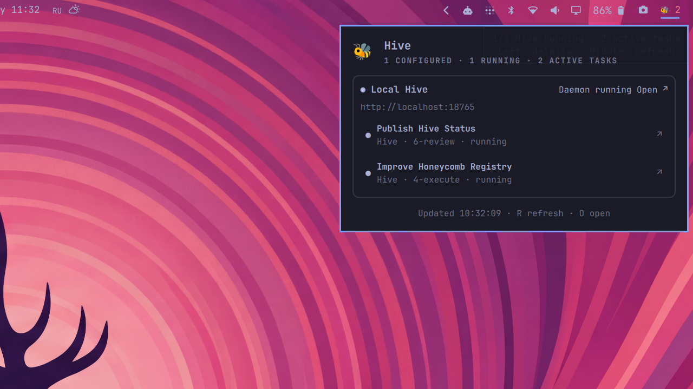

# Hive Status for Omarchy

Monitor one or more [Hive](https://github.com/ivankuznetsov/hive) instances from the Omarchy Quattro bar. The widget shows aggregate daemon health and active-task count; its popup lists every Hive, each currently running task, and links back to the corresponding Hive web interface.

The plugin supports a local Hive, remote Hives, or any mix of them. Health and task access are intentionally independent: every web URL is checked through Hive's public deep-health endpoint, while task status uses the local Hive CLI or batch-mode SSH. No Hive or GitHub credentials are copied into the plugin.



## Requirements

- Omarchy 4 / Quattro
- `curl`, `jq`, and GNU `timeout`
- `hive` for a local task feed
- OpenSSH and key-based or Tailscale SSH for a remote task feed

## Install the plugin

```bash
omarchy plugin add https://github.com/ivankuznetsov/hive-omarchy.git --enable
```

Open `omarchy plugin bar settings`, select **Hive Status**, and set **Hive instances (JSON)**.

## Configure instances

Local Hive:

```json
[
  {
    "name": "Local",
    "url": "http://127.0.0.1:4567",
    "transport": "local"
  }
]
```

Remote Hive over SSH:

```json
[
  {
    "name": "Hivebox",
    "url": "https://hivebox.mellori-lime.ts.net",
    "transport": "ssh",
    "sshHost": "hivebox"
  }
]
```

`sshHost` may be an SSH config alias, hostname, or `user@host`. Hive Status adds batch mode, connection timeout, no TTY, and `RemoteCommand=none`; this works with aliases that normally attach an interactive tmux session.

Local plus several remotes:

```json
[
  {
    "name": "Local",
    "url": "http://127.0.0.1:4567",
    "transport": "local"
  },
  {
    "name": "Hivebox",
    "url": "https://hivebox.mellori-lime.ts.net",
    "transport": "ssh",
    "sshHost": "hivebox"
  },
  {
    "name": "Build box",
    "url": "https://build-hive.example.ts.net",
    "transport": "ssh",
    "sshHost": "build-hive"
  }
]
```

Use `"transport":"web"` when only daemon health and an open-web link are needed. Task data is unavailable in this mode because Hive web deliberately keeps its task board behind owner authentication.

An optional `hiveCommand` selects another Hive executable, for example `"hiveCommand":"/usr/local/bin/hive"`.

## Interaction

- Left click: open the Hive status popup.
- Middle click: refresh every instance.
- Right click: open Hive web when exactly one instance is configured.
- In the popup: click a Hive header to open its web interface, or a task to open its task page.
- When Tailscale SSH requests an additional check, click **Authorize Tailscale** to open its login URL in your browser.
- Keyboard: `R` refreshes, `O` opens the first Hive, and `Esc` closes the popup.

## Helper CLI

The QML widget delegates network and CLI work to a small JSON-producing helper:

```bash
scripts/hive-status --instances '[{"name":"Local","url":"http://127.0.0.1:4567","transport":"local"}]'
scripts/hive-status --instances '[]' --check
```

Instances are probed concurrently, so one slow or offline remote does not serially delay all the others. A failed task feed remains visible alongside independently observed daemon health.

## Development

Keep the source in `~/Dev/hive-omarchy` and link it into the Quattro plugin directory:

```bash
ln -s ~/Dev/hive-omarchy ~/.config/omarchy/plugins/io.github.ivankuznetsov.hive-status
omarchy plugin rescan
omarchy plugin enable io.github.ivankuznetsov.hive-status --section right
```

Validate it with the same workflow as `screenote-omarchy`:

```bash
omarchy plugin validate .
qmllint -I /usr/share/omarchy/shell Panel.qml Service.qml
shellcheck scripts/hive-status tests/run tests/fakes/*
tests/run
```

## Remove

```bash
omarchy plugin remove io.github.ivankuznetsov.hive-status --yes
```

Removal leaves Hive, SSH configuration, and every Hive instance untouched.

## License

MIT
